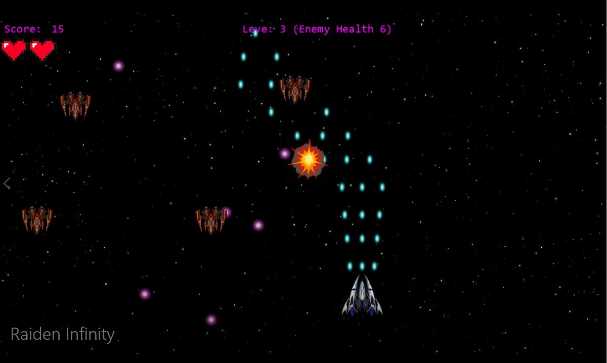
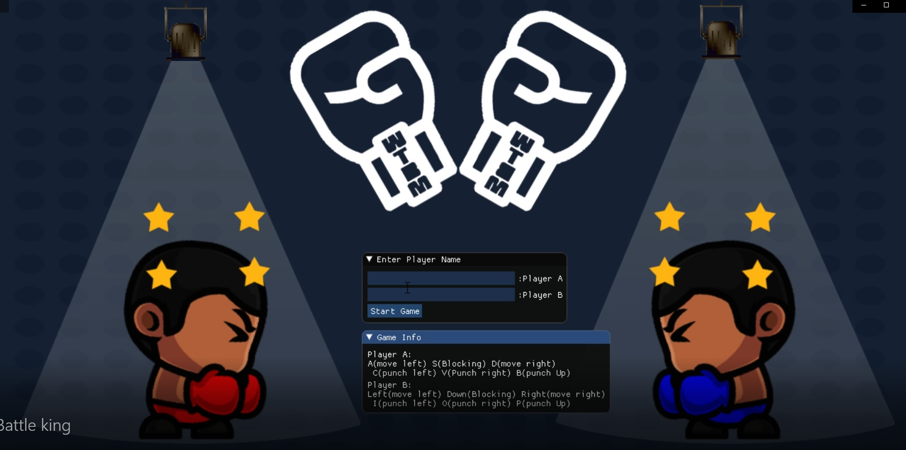
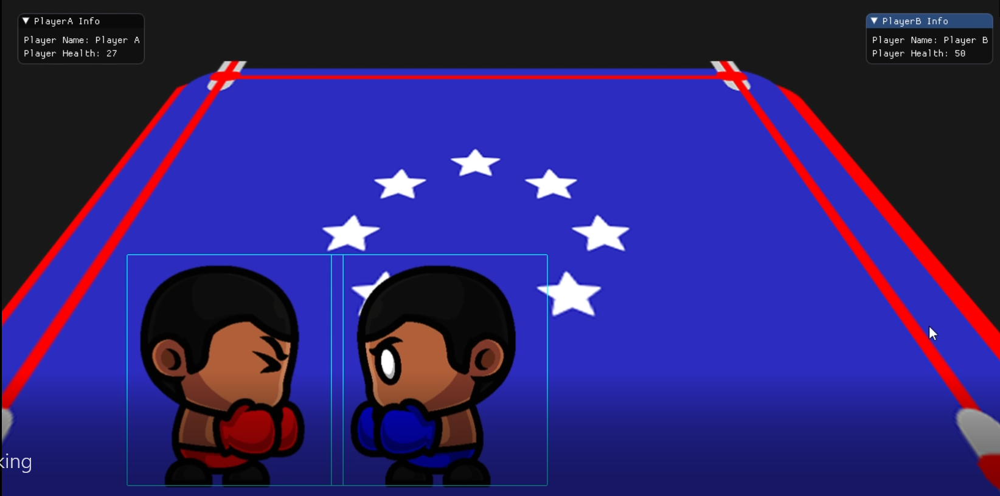

# 2D Games
>Using existed "XEngine" code  

## Raiden: Infinity
>2D Vertical Shooter Game  
>January 2019 – March 2019 (C++, Custom Engine)
-	Implemented background scrolling which adjusts based on the speed of the spaceship.
-	Implemented a bullet manager to handle all the bullets for enemy and player.
-	Implemented sprite animation for enemy explosions, and spaceship speedup thrusters.
-	Implemented collision detection.

## Battle King
>2D Multiplayer Fighting Game  
>January 2019 – March 2019 (C++, Custom Engine)  
-	Implemented sprite animation for player movement.
-	Implemented a state machine to handle the animation.
-	Implemented collision box.
-	Used ImGui to implement UI options for debugging/testing.

